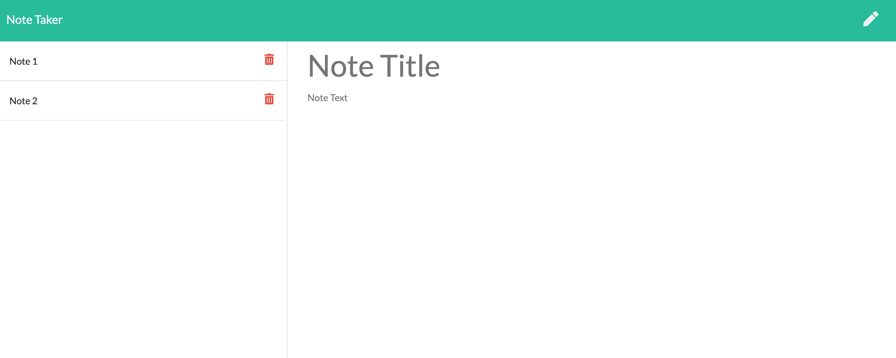

# Note Taker

## Description
A simple application that allows user to create notes, edit and delete. The application is written in node.js and is deployed in Heroku.

## Installation
Run `npm install` followed by `npm start`

## Usage
1. To create new note - enter title, description and click save button located on top right.
2. To view an existing note - click on the note's title on left hand side.
3. To delete an existing note - click on the red trash icon.
4. To add a new note - click on the pencil icon located on top right.

## Deployed Application
https://pretty-notes.herokuapp.com/

## Screenshots
